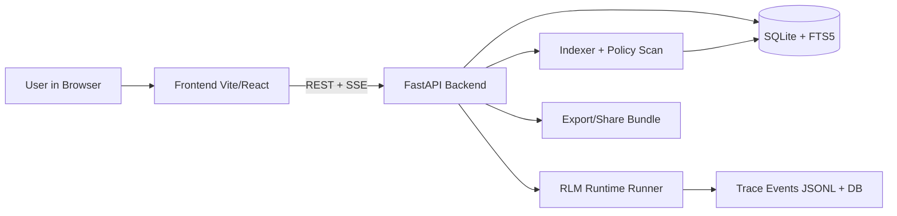
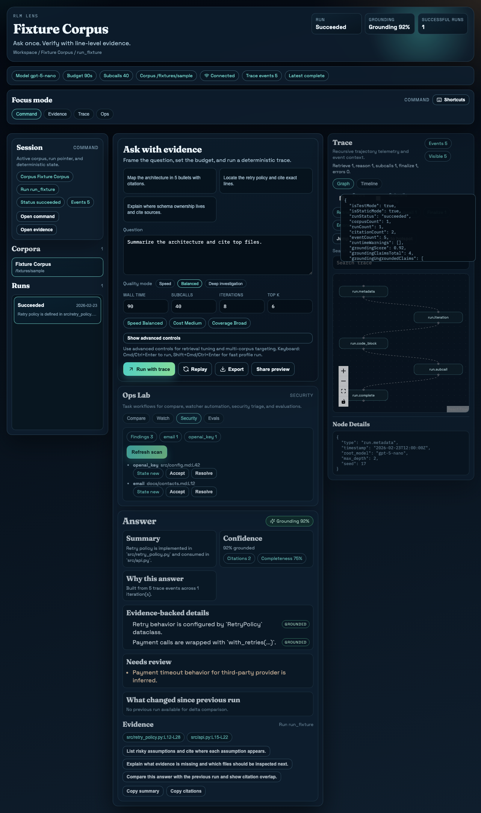
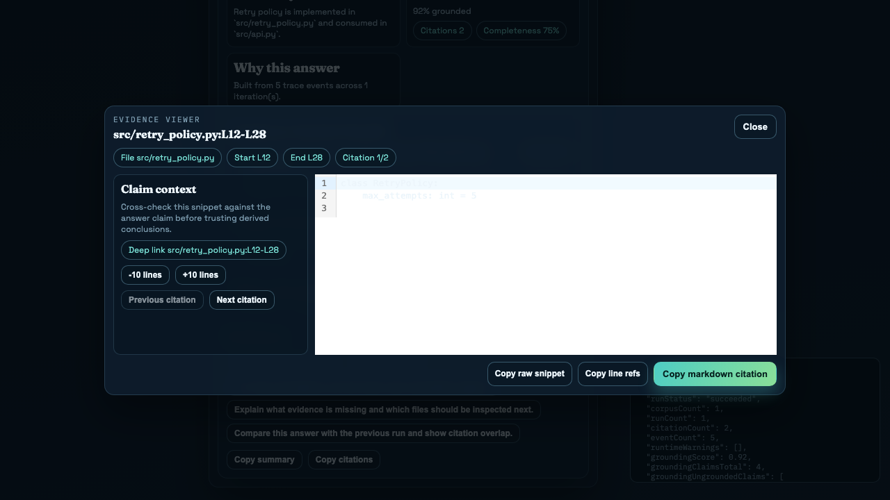
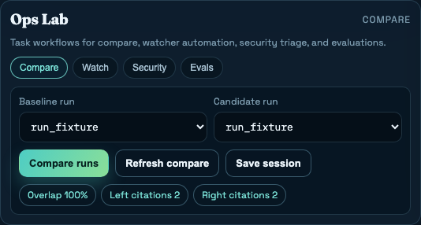

```text
██████╗ ██╗     ███╗   ███╗      ██╗     ███████╗███╗   ██╗███████╗
██╔══██╗██║     ████╗ ████║      ██║     ██╔════╝████╗  ██║██╔════╝
██████╔╝██║     ██╔████╔██║█████╗██║     █████╗  ██╔██╗ ██║███████╗
██╔══██╗██║     ██║╚██╔╝██║╚════╝██║     ██╔══╝  ██║╚██╗██║╚════██║
██║  ██║███████╗██║ ╚═╝ ██║      ███████╗███████╗██║ ╚████║███████║
╚═╝  ╚═╝╚══════╝╚═╝     ╚═╝      ╚══════╝╚══════╝╚═╝  ╚═══╝╚══════╝

Infinite context. Auditable answers. Deterministic trace UX.
```

RLM-Lens is a local-first analysis cockpit for code/docs corpora using Recursive Language Models (RLMs).

It gives you:
- Evidence-backed answers with clickable file/line citations.
- A live recursion trace graph + timeline.
- Retrieval/runtime controls for speed vs depth tradeoffs.
- Deterministic visual verification and reproducible demo artifacts.

## Why this exists
Most AI tooling shows an answer, not the path to the answer. RLM-Lens makes trust a first-class feature.

## Product highlights
- Instant demo onboarding: one-click starter corpus materialize + index + workspace handoff.
- Starter corpus packs: instant demo data without bringing your own corpus.
- Onboarding 3.0: guided setup, preflight checks, and profile presets.
- Evidence UX: side-by-side viewer, citation navigation, context expansion, copy variants.
- Ops Lab: run compare, corpus watch, policy triage, and eval workflows.
- Visual rigor: cross-browser deterministic snapshots with geometry assertions.

## Architecture (Mermaid)


## Screenshots





## Quickstart (local, under 5 minutes)
1. Prerequisites
- Python 3.12
- `uv`
- Node 20+
- `pnpm`
- Optional: Docker Desktop

2. Environment
```bash
cp .env.example .env
# set OPENAI_API_KEY=...
```

3. Run
```bash
make dev
```
- Frontend: http://127.0.0.1:5173
- Backend docs: http://127.0.0.1:8765/docs

4. Demo
```bash
make demo
```

5. Materialize starter corpora
```bash
make starter-corpora
```

## Quality gates
```bash
make check
make e2e
make verify-visual
```

## Deployment (recommended split)
- Frontend: Vercel (static Vite build)
- Backend: Railway (FastAPI + persistent data volume)

Config files included:
- `vercel.json`
- `railway.json`
- `backend/Dockerfile`

Deployment guide: [`docs/DEPLOYMENT_VERCEL_RAILWAY.md`](docs/DEPLOYMENT_VERCEL_RAILWAY.md)

Current live endpoints (as of February 24, 2026):
- Frontend: [https://rlm-lens.vercel.app](https://rlm-lens.vercel.app)
- Backend: [https://backend-production-4b1cb.up.railway.app](https://backend-production-4b1cb.up.railway.app)

## Documentation map
### Non-technical
- [`docs/NON_TECHNICAL_OVERVIEW.md`](docs/NON_TECHNICAL_OVERVIEW.md)
- [`docs/ONBOARDING_GUIDE.md`](docs/ONBOARDING_GUIDE.md)
- [`docs/USER_GUIDE.md`](docs/USER_GUIDE.md)

### Technical
- [`docs/ARCHITECTURE.md`](docs/ARCHITECTURE.md)
- [`docs/API_SPEC.md`](docs/API_SPEC.md)
- [`docs/TRACE_FORMAT.md`](docs/TRACE_FORMAT.md)
- [`docs/RUNBOOK.md`](docs/RUNBOOK.md)
- [`docs/TROUBLESHOOTING.md`](docs/TROUBLESHOOTING.md)
- [`docs/visual-verification-protocol.md`](docs/visual-verification-protocol.md)

### Showcase
- [`docs/showboat/rlm_lens_release_demo.md`](docs/showboat/rlm_lens_release_demo.md)

## License
MIT (`LICENSE`)

---
This is a personal R&D project by Jason Lovell, built in an individual capacity.
It is not affiliated with, endorsed by, or representative of the views of his employer.
