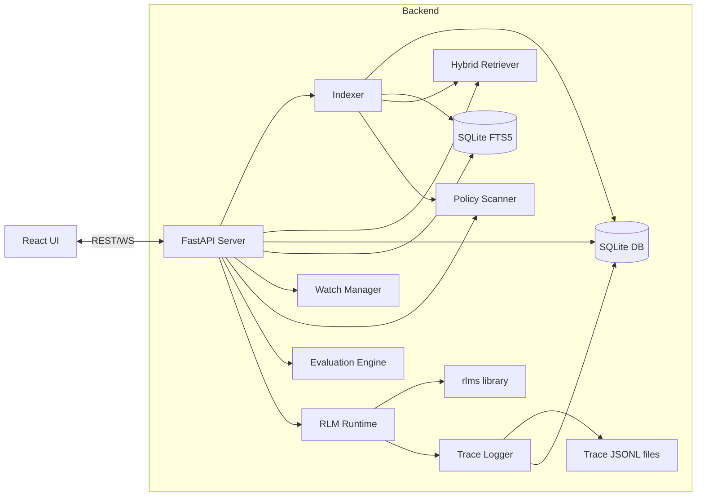
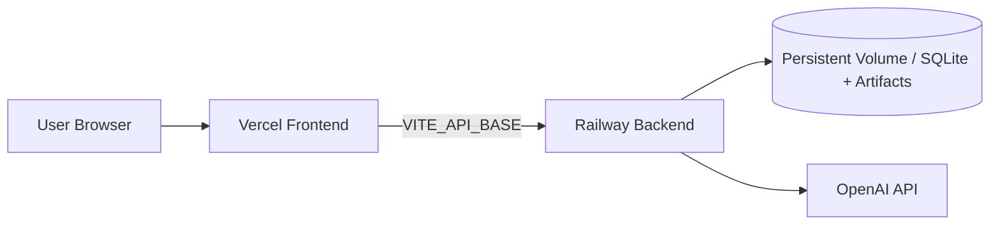

# Architecture — RLM-Lens

## 1. High-level overview
RLM-Lens is a local-first system with:
- **Indexer**: builds a searchable local index of a corpus
- **Hybrid retriever**: blends BM25 + vector + rerank scoring
- **Runtime**: runs RLM queries against that corpus with budgets and tracing
- **Trace store**: persists traces (JSONL + SQLite)
- **Watch manager**: polls filesystem fingerprints and triggers auto-reindex
- **Policy scanner**: detects sensitive patterns during indexing
- **Evaluation engine**: runs benchmark query suites and reports quality summary
- **API server**: FastAPI that exposes indexing + run APIs + streaming events
- **Frontend**: React app for onboarding, chat, evidence, trace exploration

## 2. Component diagram (logical)

## 3. Data flow: indexing
1. User selects a folder
2. Backend walks files according to:
   - include globs
   - exclude globs
   - max size
   - binary detection
3. For each file:
   - compute content hash (sha256)
   - store metadata in DB
   - store text content in FTS table
   - upsert retrieval vector for hybrid search
   - scan and persist policy findings
4. Maintain a corpus snapshot manifest: list of file hashes and settings

### Incremental index
- Keyed by `(path, size, mtime, sha256)`
- Reindex if any of these change
- Keep prior version data for old runs (optional; can be "best effort")

## 4. Data flow: query run
1. UI sends `POST /api/runs` with:
   - corpus id
   - messages
   - runtime config (budgets, environment, model)
2. Server creates a Run row + run workspace directory:
   - `./.rlm-lens/runs/<run_id>/`
3. Server starts runtime in background task:
   - initialize RLM client (`RLM(...)`)
   - initialize LensLogger (wraps RLMLogger format)
   - load “lens tools” object into RLM REPL environment
4. Runtime emits events:
   - metadata
   - iteration start/end
   - code block executed
   - subcall prompt/response
   - budgets usage update
5. Events are:
   - appended to JSONL
   - stored to DB (normalized or JSON blob)
   - streamed to UI via WS/SSE
6. Final answer:
   - parsed into answer text + citations
   - stored to DB
   - sent to UI

## 5. RLM integration design
### 5.1 Why a wrapper logger?
The official RLM library supports trajectory logging to JSONL and in-memory metadata.
RLM-Lens needs:
- live UI streaming
- DB queryability
- stable schema for export bundles

So implement `LensLogger` that:
- delegates to `RLMLogger`-compatible JSONL entries
- emits structured events to an async queue for streaming

### 5.2 Sandbox strategy
Default: Docker REPL sandbox (if Docker available).
Fallback: Local REPL with restricted globals and clear warnings.

### 5.3 Tool surface in the REPL
The model should not have arbitrary access to the filesystem beyond the selected corpus.
Expose a single object, e.g. `lens`, with safe methods:
- `lens.search(query: str, limit: int=10) -> list[SearchHit]`
- `lens.read(path: str, start_line: int, end_line: int) -> FileSlice`
- `lens.peek(path: str, max_chars: int=2000) -> str`
- `lens.list(dir: str) -> list[str]`
- `lens.stats()` (corpus metrics)

`lens` internally enforces allowlist/denylist and prevents traversal.

## 6. Storage design
### 6.1 SQLite tables (suggested)
- `corpora`
- `files`
- `file_vectors`
- `runs`
- `messages`
- `citations`
- `trace_events` (or store raw json per run)
- `exports`
- `index_watchers`
- `pii_findings`
- `eval_runs`

FTS5:
- `file_fts(path, content, tokenize=porter)` (or unicode61)

### 6.2 Trace file layout
`./.rlm-lens/runs/<run_id>/trace.jsonl`

Export bundle:
`./.rlm-lens/exports/<run_id>_<ts>.zip`

## 7. API design
See `docs/API_SPEC.md` for endpoints and payloads.
Principles:
- REST for control plane (create run, list runs, fetch artifacts)
- WS/SSE for data plane (stream events)
- Additional operations APIs cover compare/watch/policy/evals.

## 8. Budget governance
Budgets enforced in runtime:
- max wall time
- max iterations
- max depth
- max subcalls
- optional max tokens

Implementation:
- maintain a `BudgetState`
- check at each iteration/subcall boundary
- on exceed:
  - stop further recursion
  - produce partial result explaining what happened
  - mark run status = `partial_budget_exceeded`

## 9. Security & privacy
- Local-first server binds to localhost by default.
- Deny reading outside corpus root (resolve realpath, enforce prefix).
- Do not log secrets in traces; redact env var patterns and common keys.
- Disable arbitrary imports in Local REPL where possible; prefer Docker REPL.

## 10. Observability
- Structured logging (json) + human-friendly console logs
- Run-level correlation id
- Trace events include timestamps and ordering ids
- Trace summary and step-level endpoints expose deterministic diagnostics to UI.

## 11. Failure modes & handling
- Provider auth errors → clear UI error with remediation
- Index corruption → rebuild option
- Large file → skip with warning entry in index report
- Docker missing → fallback to local + warning
- UI disconnect → keep run going; allow reconnect by run id

## 12. Starter corpus subsystem
RLM-Lens includes a starter corpus service so users can evaluate value before bringing their own data.

### API surface
- `GET /api/starter-corpora` — list available packs with install state.
- `POST /api/starter-corpora/{pack_id}/materialize` — copy/generate/download a pack into data storage.

### Pack types
- `local_copy`: copy bundled corpus from repo (`examples/sample_corpus`).
- `generated`: deterministic synthetic engineering corpus for larger demos.
- `remote_archive`: optional OSS archive download for realistic public corpus testing.

### Storage layout
- `RLM_LENS_DATA_DIR/starter-corpora/<pack_id>/...`
- each materialized pack includes marker metadata (`.starter-pack.json`).

## 13. Deployment topology (recommended)

Rationale:
- Frontend is static and globally cacheable on Vercel.
- Backend needs long-running jobs, file IO, and persistent data storage.

Critical runtime env:
- `RLM_LENS_DATA_DIR` for persistent storage path.
- `RLM_LENS_CORS_ORIGINS` locked to deployed frontend domains.
- `VITE_API_BASE` pointing frontend to Railway backend URL.
