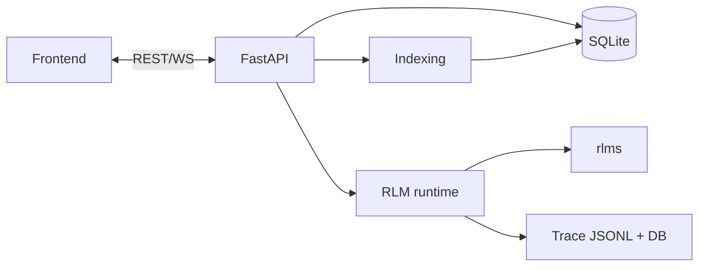
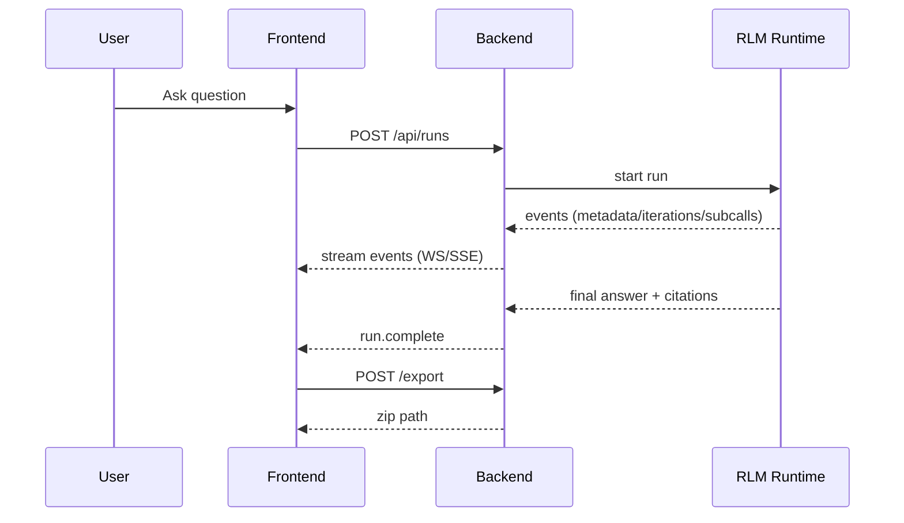
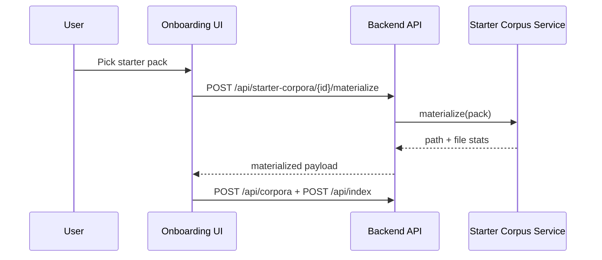
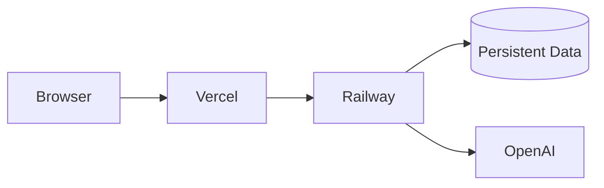

# Diagrams — RLM-Lens

This folder provides diagrams in two forms:
- Mermaid sources (easy to edit)
- Exported SVGs in `assets/diagrams/` (easy to embed in README)

## 1. System architecture
Mermaid:

Exported SVG:
- `assets/diagrams/architecture.svg`

## 2. Run lifecycle

## 3. Starter corpus materialization

## 4. Deployment split

