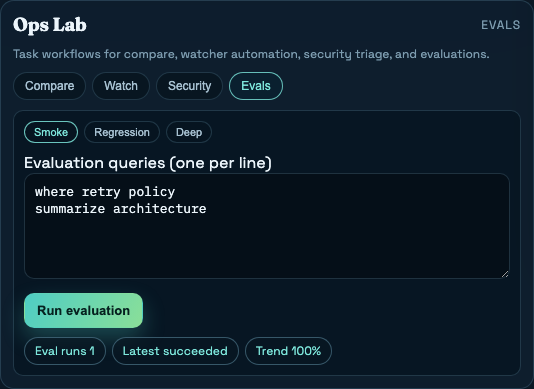

# RLM-Lens Release Showcase

*2026-02-24T17:21:00Z by Showboat dev (final closure pass + live deployment)*
<!-- showboat-id: 5b3a747c-4f30-4f58-a470-f7cbe3de7d10 -->

Deterministic verification and release-readiness showcase for the current RLM-Lens build.

```bash
make check
```

```output
Resolved 35 packages in 4ms
Audited 34 packages in 0.76ms
All checks passed!
36 files already formatted
Success: no issues found in 26 source files
.............................                                            [100%]
29 passed in 2.85s
Lockfile is up to date, resolution step is skipped
Already up to date

╭ Warning ─────────────────────────────────────────────────────────────────────╮
│                                                                              │
│   Ignored build scripts: esbuild@0.21.5.                                     │
│   Run "pnpm approve-builds" to pick which dependencies should be allowed     │
│   to run scripts.                                                            │
│                                                                              │
╰──────────────────────────────────────────────────────────────────────────────╯
Done in 209ms using pnpm v10.29.3

> rlm-lens-frontend@0.1.0 lint /workspace/RL-Lens/frontend
> eslint .


> rlm-lens-frontend@0.1.0 typecheck /workspace/RL-Lens/frontend
> tsc --noEmit


> rlm-lens-frontend@0.1.0 test /workspace/RL-Lens/frontend
> vitest run


 RUN  v2.1.9 /workspace/RL-Lens/frontend

 ✓ src/components/TracePanel.perf.test.tsx (1 test) 8ms
 ✓ src/components/VirtualizedList.test.tsx (1 test) 14ms
 ✓ src/components/CitationChips.test.tsx (1 test) 31ms
 ✓ src/components/TracePanel.test.tsx (1 test) 54ms
(node:1928) Warning: `--localstorage-file` was provided without a valid path
(Use `node --trace-warnings ...` to show where the warning was created)
 ✓ src/components/Onboarding.test.tsx (1 test) 60ms
 ✓ src/App.test.tsx (2 tests) 288ms

 Test Files  6 passed (6)
      Tests  7 passed (7)
   Start at  10:47:30
   Duration  811ms (transform 152ms, setup 96ms, collect 463ms, tests 295ms, environment 748ms, prepare 189ms)

```

```bash {image}

```


```bash {image}

```


```bash {image}

```


```bash {image}

```



Live deployment:
- Frontend: https://rlm-lens.vercel.app
- Backend: https://backend-production-4b1cb.up.railway.app
